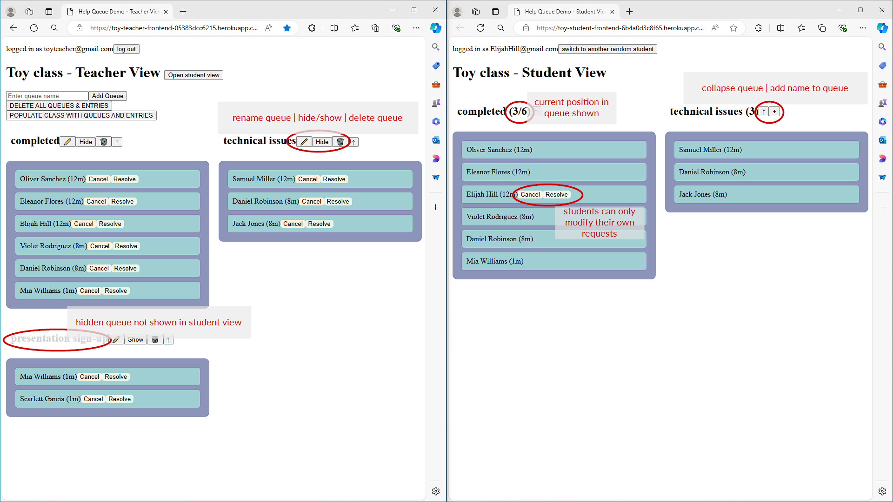

# Student Help Queue

## [Live Demo](https://toy-teacher-frontend-05383dcc6215.herokuapp.com/)

## Project Overview

Student Help Queue is a web-based ticketing system designed to facilitate communication between teachers and students. It allows teachers to manage class-specific queues for various purposes such as immediate assistance requests or assignment completion notifications. Students can add themselves to these queues, and either they or their teachers can remove them once the request is resolved.

## Features

- **Class Management**: Teachers can create and manage multiple classes.
- **Queue Management**: Within each class, teachers can create, rename, and modify multiple queues.
- **Real-time Updates**: Students can view active queues in their class and add/remove their names.
- **Wait Time Display**: The system shows the order of requests and displays wait times.
- **Dual Interfaces**: Separate frontends for teachers and students with appropriate permissions.

*Side-by-side comparison of Teacher and Student views*

## Technology Stack

- **Backend**: Node.js with Express.js
- **Database**: MongoDB
- **Frontend**: React

## License

This project is licensed under the MIT License - see the [LICENSE](LICENSE) file for details.
